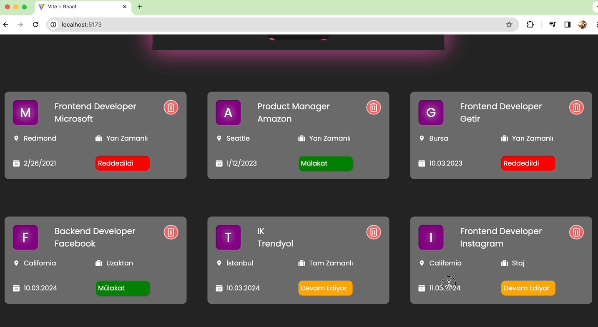

<h1>İş Takip Uygulaması</h1>

Bu basit iş takip uygulaması, kullanıcının iş başvurularını yönetmesine olanak tanır. Kullanıcılar, başvurdukları işlerin detaylarını ekleyebilir, güncelleyebilir, silebilir ve arama ve sıralama seçenekleriyle işleri filtreleyebilirler.

<h2>Özellikler</h2>

Kullanıcılar iş başvurularını ekleyebilir, güncelleyebilir ve silebilir.
Kullanıcılar iş başvurularını pozisyon, şirket adı, lokasyon, durum ve tür gibi kriterlere göre filtreleyebilir.
Kullanıcılar iş başvurularını şirket adı veya pozisyon adına göre arayabilir.
Kullanıcılar iş başvurularını şirket adına veya türe göre sıralayabilir.
Hızlı ve kullanıcı dostu bir arayüz sağlar.

<h2>Nasıl Kullanılır?</h2>

Ana sayfada, mevcut iş başvuruları listelenir.
"İş Ekle" sayfasından yeni bir iş başvurusu ekleyebilirsiniz. Gerekli alanları doldurun ve "Submit" düğmesine tıklayın.
Ana sayfada, listelenen iş başvurularını aramak, filtrelemek veya sıralamak için "Filtreleme Formu"nu kullanın.
Herhangi bir iş başvurusunun yanındaki "Sil" düğmesine tıklayarak bir iş başvurusunu silebilirsiniz.

<h2>Kurulum</h2>

Bu projeyi klonlayın: git clone https://github.com/kullanici/is-takip-uygulamasi.git
Proje dizinine gidin: cd is-takip-uygulamasi
Gerekli paketleri yükleyin: npm install
Uygulamayı başlatın: npm start

<h2>Teknolojiler</h2>

React.js
Redux Toolkit
React Router
Axios
React Icons
React Toastify
SCSS

<h2>Ekran Görüntüsü</h2>

